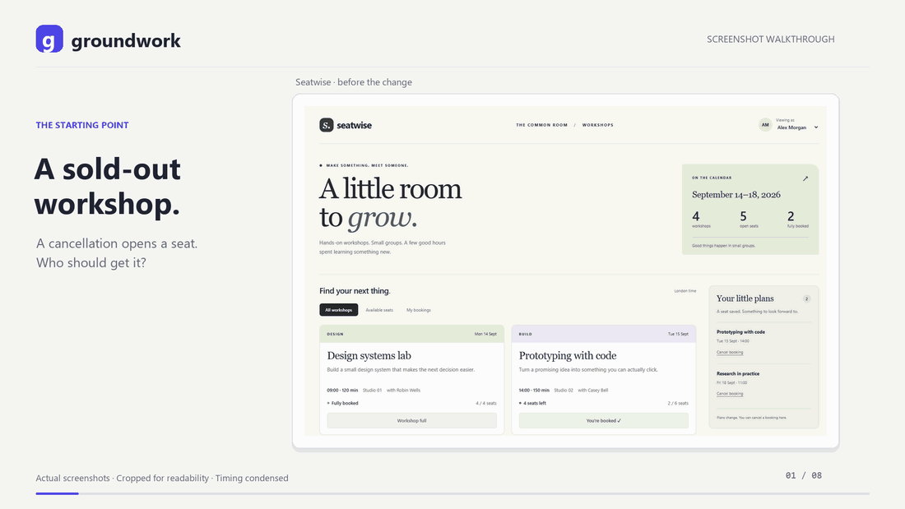

# Groundwork

[](https://github.com/ahmtsahin/groundwork/actions/workflows/ci.yml)
[](LICENSE)
[](https://skills.sh/ahmtsahin/groundwork/settle)

**Read the code. Settle the decisions. Build with a clear brief.**

Groundwork is a plugin for **Codex and Claude Code**. Its `settle` skill turns
a rough coding request into a concrete, agreed outcome: it inspects your
repository, asks the questions the code cannot answer, confirms the scope,
then implements and verifies the result.

**Every question uses your agent's native question UI.** Pick a recommended
option or write your own answer in the built-in form. Follow-up questions and
the final scope check use that same interface, keeping the conversation in
your current task.



*Real screenshots from a Codex session, cropped and edited for readability.
The walkthrough ends at the final scope check.
[Read the usage guide](docs/usage.md).*

[Install](#install) · [Usage](#usage) · [How it works](#how-it-works) ·
[Contributing](CONTRIBUTING.md) · [Changelog](CHANGELOG.md)

## Install

Use an installed, signed-in Codex or Claude Code with plugin support.
Groundwork ships ready to load: **no build step, npm install, API key, or extra
service is needed for the plugin**.

Install directly from [ahmtsahin/groundwork](https://github.com/ahmtsahin/groundwork)
with the commands below. No local clone is needed. To use a downloaded or
cloned copy instead, see [local installation](docs/installation.md#from-a-local-checkout).

### Codex

Run in your terminal:

```sh
codex features enable default_mode_request_user_input
codex plugin marketplace add ahmtsahin/groundwork
codex plugin add groundwork@groundwork
```

Start a **new Codex task** in your project, in **Default mode**, and enter:

```text
$settle Fix exports that sometimes return old data.
```

This uses Codex's built-in `request_user_input` form. The feature flag above
enables it in Default mode. The CLI and app must use the same Codex profile;
see [Codex setup](docs/installation.md#codex).

### Claude Code

Run in your terminal:

```sh
claude plugin marketplace add ahmtsahin/groundwork
claude plugin install groundwork@groundwork
```

Start a **new Claude Code session** in your project and enter:

```text
/groundwork:settle Fix exports that sometimes return old data.
```

This uses Claude Code's built-in `AskUserQuestion` form.

### Skills CLI

The [`skills` CLI](https://skills.sh/ahmtsahin/groundwork/settle) installs the
same skill into a project without either plugin system, for Codex, Claude
Code, and other agents that read `SKILL.md` files:

```sh
npx skills add ahmtsahin/groundwork
```

Select the agents you use when asked. Codex still needs the feature flag above
and invokes `$settle`; Claude Code invokes `/settle` instead of
`/groundwork:settle`.

[Updates, uninstall, and troubleshooting](docs/installation.md)

## Usage

Describe the outcome you want. You do not need to write a specification first.

| Intent | Codex | Claude Code |
|---|---|---|
| Fix existing behavior | `$settle Fix stale exports.` | `/groundwork:settle Fix stale exports.` |
| Add a capability | `$settle Deliver reports automatically.` | `/groundwork:settle Deliver reports automatically.` |
| Explore the repository | `$settle` | `/groundwork:settle` |

A bare invocation starts repository discovery and opens a native question
about a concrete direction. On Codex, invocation is explicit: use `$settle`
when you want this workflow.

### Native questions, throughout

Groundwork puts the relevant repository evidence before the form. Each
question focuses on one decision, explains its consequence, and offers a
recommendation with its tradeoff. You can always supply your own answer.

| Host | Built-in tool | Questions per form |
|---|---|---|
| Codex, Default mode | `request_user_input` | 1–3 |
| Claude Code | `AskUserQuestion` | 1–4 |

Independent decisions can share a form. If an answer unlocks another decision,
Groundwork asks a follow-up round. Before implementation, you review the
resolved outcome, included behavior, exclusions, and verification plan in one
final native form.

If the native tool is unavailable or a required question is dismissed, the
skill is instructed to stop before implementation. An unanswered question
does not authorize a choice on your behalf.

## How it works

1. **Read the repository.** Inspect project instructions, relevant code,
   tests, and earlier decision records. Resolve facts from files first.
2. **Identify the work.** Use a bounded path for an existing flow, an
   architectural path for a new subsystem or boundary, or a small spike for
   a feasibility question. Architectural work compares approaches first.
3. **Settle the decisions.** Ask through native forms and check scope, edge
   behavior, state, compatibility, trust, failure, and recovery.
4. **Confirm the brief.** Review what will change and the check that will
   demonstrate it. Correct the scope before implementation starts.
5. **Implement and verify.** Make focused changes, run relevant checks,
   and save the decisions in `docs/decisions/YYYY-MM-DD-<topic>.md`.

Later invocations read relevant decision records so settled choices need not
be asked again unless the code has changed. In Plan mode, the skill produces
a plan without editing files; the Codex workflow documented here targets
Default mode.

[Read the full usage guide](docs/usage.md)

## What to expect

Groundwork is useful when a plausible implementation could still deliver the
wrong behavior. A trivial edit with a fully specified outcome may not need
several decision rounds.

The workflow uses the model and tools provided by your coding agent. Models
can still miss edge cases or ask unnecessary questions; review the final
brief and verification results. More rounds also mean more time and token
usage. Questions follow your language, while code and documentation follow
the repository's language.

## Development

Contributors need **Node.js 22.17.0 or newer**:

```sh
npm ci
npm run check
npm test
```

The skill lives in `plugin/skills/settle/SKILL.md`, and both hosts load the
`plugin/` folder as the plugin; there is no build step. Tests check that the manifests agree
and that the skill names a host's question tool only in its native question
section. See [CONTRIBUTING.md](CONTRIBUTING.md) for package checks and the
[evaluation guide](eval/README.md) for optional behavioral runs.

## License

[MIT](LICENSE) · Copyright © 2026 Ahmet Sahin.
