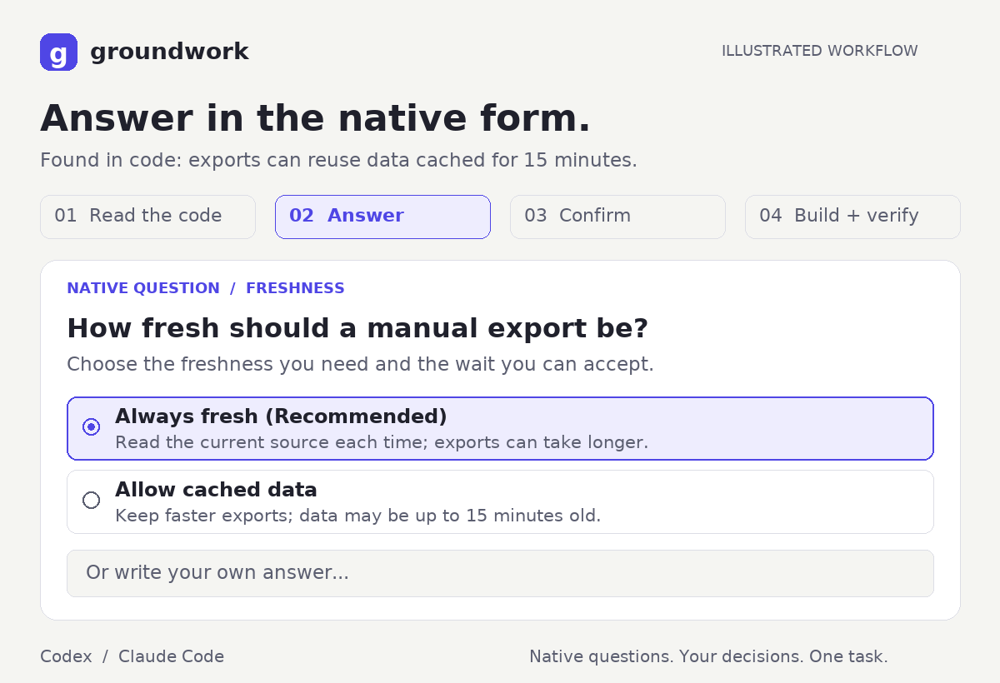

# Using Groundwork

Invoke `settle` in the repository where you want work done. Describe a problem
or outcome in your own words; the skill inspects the project before asking
you to make decisions.

| Host | Invocation |
|---|---|
| Codex | `$settle Your request here.` |
| Claude Code | `/groundwork:settle Your request here.` |

## Example: fix stale exports

This is an illustrative session. File names, answers, and check results below
describe the example, not a recorded run or a guaranteed test result.

1. **You describe the problem:** “Fix exports that sometimes return old data.”
2. **Groundwork inspects the code:** in this example, `src/cache.js` retains
   data for 15 minutes and `src/exporter.js` uses that cache. It identifies the
   work as a change inside an existing flow.
3. **A native form asks a product question:** “How fresh should a manual export
   be?” The evidence explains why old data appears; the options explain the
   remaining tradeoff.

   | Option | Consequence |
   |---|---|
   | Always fresh (Recommended) | Read the current source for each manual export; the export can take longer. |
   | Allow cached data | Keep faster exports; data may be up to 15 minutes old. |
   | Your own answer | Describe another freshness requirement in the host's free-form control. |

4. **You choose “Always fresh.”** Groundwork asks any further material
   questions unlocked by that choice, such as what to do when the source
   cannot be read. Facts already fixed by the repository are not questions.
5. **You review the final brief in another native form.** In this example:
   refresh manual exports, preserve scheduled exports and CSV columns,
   report a failed source read, and run the exporter tests. You can confirm
   or revise the scope.
6. **Groundwork implements and checks the agreed behavior.** It reports the
   executed checks and saves the answers and verification evidence in
   `docs/decisions/YYYY-MM-DD-export-freshness.md`.

The [animated example](assets/native-questions.gif) shows the same flow in
four short scenes. Its middle scenes are condensed; real work may need more
than one question round.

## Start without a task

Enter just `$settle` or `/groundwork:settle`. Groundwork makes a bounded pass
through project instructions, code, tests, and previous decisions, then
states what it found and opens a question about a concrete direction.

Use the free-form answer if none of the suggested directions fits. The
recommendation is a proposal you can change.

## Answer the native forms

Each form focuses on decisions that change the outcome. Codex carries one to
three questions per form; Claude Code carries one to four. Independent
questions can arrive together, and dependent questions arrive after the
answer they need.

Choose an option or write a custom answer in the host's own control. Answers
return through the tool, so Groundwork can continue within the same task.
Do not treat a dismissed form as an answer: the skill should stop before
implementation when a required decision is missing.

## Match the depth to the work

| Path | Typical request | Workflow |
|---|---|---|
| Bounded | Fix a bug or change a default in an existing flow | Inspect, settle behavior, confirm, implement, verify. |
| Architectural | Add a subsystem, API, persistent format, or trust boundary | Compare approaches, then settle and implement the chosen one. |
| Spike | Find out whether an approach is feasible | Confirm a small temporary probe and report the evidence. |

Groundwork states the path before asking. You can correct the interpretation
through the native form. A spike leaves no implementation or decision record.

## Review the final brief

Before confirming, check the intended outcome, included behavior, exclusions,
compatibility promises, and the test or check that will prove the work. If
something is missing, revise the scope in the form. The skill should carry
your exact decisions into both the code and the decision record.

The internal decision check covers scope, edge inputs, state, compatibility,
trust, failure, and interface boundaries. You see entries settled by your
answers; repository evidence and reasons a concern cannot arise are saved
in the record. It is a review aid, not proof that a model found every edge case.

## Plans and decision records

In Plan mode, the skill prepares the resolved plan without editing files.
The Codex installation and acceptance flow target Default mode with native
input enabled.

After implementing bounded or architectural work and running checks,
Groundwork writes `docs/decisions/YYYY-MM-DD-<topic>.md`. The record contains
the request, path, questions and answers, decision check, confirmed brief,
and verification evidence. Later invocations consult relevant records first.

Questions and summaries follow your language. Code and documentation keep
the repository's language.
